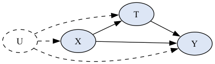

# The Causal Effect of Birthweight on Infant Mortality

**Twins Dataset — ATE, CATE, and Validation**

Hannah Yamashita
Causal Models in Data Science

::: notes
Hi everyone, I'm Hannah, and this is my final project on estimating the causal effect of birthweight on infant mortality using the Twins dataset. Over the next 20 minutes I'll walk through the question, the methodology, the headline ATE result, the CATE analysis, and the most interesting finding — which is about *when* CATE estimates from observational data are and aren't trustworthy.
:::

---

# The Question

**Does birthweight *cause* infant mortality, or is the association mostly driven by maternal and pregnancy risks that also lead to lower birthweight?**

This distinction matters for intervention:

- If **causal** → improving fetal growth could reduce mortality
- If **confounded** → resources better spent on the upstream maternal conditions

The size of the causal effect is what determines which prenatal interventions to prioritize.

::: notes
Low birthweight is one of the strongest predictors of infant mortality, but predictors aren't necessarily causes. The maternal conditions that drive low birthweight — preeclampsia, diabetes, hypertension, smoking — also independently raise mortality risk. So the policy question is whether we should be intervening on birthweight itself, or on the upstream conditions. That depends on the size of the *causal* effect, and that's what I set out to estimate.
:::

---

# The Twins Dataset

- **Source**: Louizos et al. (2017), AMLab-Amsterdam/CEVAE
- **Sample**: 11,984 same-sex twin pairs, both infants < 2 kg
- **Treatment T**: indicator for the heavier twin (1 = heavier)
- **Outcome Y**: one-year mortality (binary; P(Y=1) = 0.18)
- **Covariates X**: 50 maternal and pregnancy characteristics
    - Pregnancy: gestational age, prenatal visits, parity
    - Maternal demographics: age, education, race, marital status
    - Risk indicators: diabetes, hypertension, anemia, preterm history
    - Administrative: state, birth month, data year

**Why Twins?** Both potential outcomes are observed for every pair — I can construct a **design-based ground truth**.

::: notes
The Twins dataset is special because it's one of very few causal-inference benchmarks where we observe both potential outcomes — both the heavier twin's mortality and the lighter twin's mortality are recorded for every pair. That gives me a per-pair ground truth that I can use to validate observational causal estimators. I'm restricting to same-sex pairs where both infants weigh under 2 kg, following the standard Louizos et al. preprocessing — that leaves about 12,000 pairs and 50 covariates.
:::

---

# Setting Up the Observational Study

Because both potential outcomes are observed, the ATE is *trivially* identified by the within-pair difference. To make this look like a real observational study, I simulate confounded treatment assignment:

```
p_i = sigmoid(z_i^T w + n_i),  T_i ~ Bernoulli(p_i)
```

- `z_i` = standardized covariate vector
- `w ~ N(0, 0.1 I)`, `n_i ~ N(0, 0.1)`
- The observed outcome `Y_i` = the *selected* twin's mortality
- The other twin's outcome is **held back as ground truth** for validation in §5

::: notes
The whole point of this setup is that I have ground truth waiting on the other side. I randomly select one twin per pair as "treated," with the selection probability depending on the standardized covariates — so treatment assignment correlates with things that also predict mortality. That's the confounding observational analysts have to deal with. I hold back the other twin's outcome and use it only as validation later in section 5.
:::

---

# Overlap and Balance

::: columns
::: {.column width="50%"}

:::
::: {.column width="50%"}

:::
:::

- **Overlap**: propensities concentrate near 0.5, full unit-interval coverage → no trimming
- **Imbalance**: top SMDs 0.15–0.43 in state/region, birthplace, race, birth order, parental education
- → Meaningfully confounded, but overlap preserved (the estimators have real adjustment work to do)

::: notes
Two pre-estimation diagnostics. On the left, the propensity-score overlap plot shows both treatment groups cover the full unit interval, so positivity holds and I don't need to drop any units for extreme propensities. On the right, the standardized mean differences show real pre-adjustment imbalance — top SMDs from 0.15 to 0.43 in administrative and demographic variables. So the setup is realistic: there's substantive confounding, but enough overlap to make valid adjustment possible.
:::

---

# Identification

{width=45%}

Four standard assumptions:

1. **Conditional ignorability**: `Y(0), Y(1) ⊥ T | X` (true by construction in the simulation)
2. **Positivity**: `0 < P(T=1|X) < 1` (verified empirically)
3. **Consistency**: observed `Y` equals potential `Y(T)`
4. **SUTVA**: treatment is a within-pair contrast, not a single-infant intervention

Under (1)–(4): `τ = E[μ_1(X) − μ_0(X)]`

::: notes
The DAG has the observed covariates X, treatment T, outcome Y, and unobserved pair-level factors U like placental position. The main observed backdoor is T ← X → Y, so adjusting for X identifies the ATE under four assumptions. Conditional ignorability holds by construction in the simulation. Positivity I just verified empirically. Consistency is satisfied because the observed outcome is the selected twin's actual outcome. SUTVA needs careful interpretation — treatment is a within-pair label, not a policy that increases one infant's birthweight in isolation. Under these four, the ATE is identified by averaging the difference in conditional outcome means.
:::

---

# ATE Estimators

**Outcome regression (g-formula plug-in)**
```
τ̂_OR = (1/n) Σ_i [μ̂_1(X_i) − μ̂_0(X_i)]
```

**AIPW (doubly robust)**
```
ψ_i = μ̂_1(X_i) − μ̂_0(X_i)
     + T_i(Y_i − μ̂_1(X_i)) / ê(X_i)
     − (1−T_i)(Y_i − μ̂_0(X_i)) / (1−ê(X_i))
```
`τ̂_AIPW = mean(ψ_i)`, SE = `sd(ψ_i) / √n`

- 5-fold cross-fitted `μ_t` (gradient-boosted trees) and `e` (L2 logistic)
- AIPW is consistent if *either* outcome OR propensity model is correctly specified

::: notes
I use two ATE estimators that differ along a meaningful axis. Outcome regression is single-model — it fits the conditional outcome and averages the predicted differences. AIPW combines the outcome model with a propensity model in a doubly-robust score, so the estimator is consistent if either model is correctly specified. All nuisances use 5-fold cross-fitting so each unit's prediction comes from a model that didn't see that unit — that's what makes the AIPW influence-function standard error valid even with flexible ML nuisances.
:::

---

# CATE Estimators

Five estimators sharing the cross-fit nuisances:

- **S-learner** — one GBM on `[X, T]`
- **T-learner** — two arm-specific GBMs
- **DR-learner** (Kennedy 2023) — regress AIPW pseudo-outcome on `X`
- **R-learner** (Nie & Wager 2021) — minimize `Σ(ỹ_i − t̃_i τ(X_i))²` with residuals `ỹ = Y − m̂(X)`, `t̃ = T − ê(X)`
- **Causal Forest** (Wager & Athey 2018, via `econml.CausalForestDML`) — honest splits + pointwise CIs

S and T = baselines. DR, R, CF = canonical Double/Debiased ML methods.

::: notes
For CATE I fit five estimators. S-learner and T-learner are the simple baselines from the Künzel taxonomy — known to underfit heterogeneity or be biased by arm imbalance. The DR-learner, R-learner, and causal forest are all from the double/debiased ML family — they construct orthogonal pseudo-outcomes so first-stage nuisance errors only contribute second-order bias, not first-order. These three are the headline CATE methods.
:::

---

# ATE Results

| Method | Estimate | SE | 95% CI |
|---|---:|---:|---|
| Outcome regression | **−0.0242** | 0.00057 | (−0.0253, −0.0230) |
| AIPW | **−0.0248** | 0.00647 | (−0.0375, −0.0122) |
| **Within-pair benchmark (truth)** | **−0.0252** | 0.00292 | — |

- Both estimators within **0.001** of the within-pair truth
- AIPW CI covers the truth
- **Triangulation across single-model and doubly robust estimators** → ATE conclusion is not driven by one estimator

→ **Being the heavier twin reduces one-year mortality by ~2.4–2.5 pp.**

::: notes
Outcome regression gives -0.0242, AIPW gives -0.0248, and the within-pair design-based truth is -0.0252. Both estimators land within a thousandth of the truth, and the AIPW confidence interval covers it. Crucially, these two methods agree even though one is single-model and the other is doubly robust — that's the cross-method triangulation that gives me confidence the ATE isn't an estimator artifact. The headline number: being the heavier twin reduces one-year mortality by about 2.4 to 2.5 percentage points.
:::

---

# CATE Distributions

| Method | mean(τ̂) | sd(τ̂) |
|---|---:|---:|
| S-learner | −0.018 | **0.012** ← under |
| T-learner | −0.025 | 0.062 |
| **DR-learner** | −0.025 | **0.168** ← over |
| R-learner | −0.024 | 0.059 |
| Causal Forest | −0.024 | 0.022 ← under |
| **True ITE** | −0.025 | 0.320 |

**Non-parametric lower bound: `sd[τ(X)] ≥ 0.079`** (between-bin variance of true ITE, 50 bins ranked by CF)

- All five agree on the *mean*; widely disagree on the *spread*
- S and CF under-disperse; T and R closest; DR is mostly noise

::: notes
All five CATE methods agree on the average treatment effect — they're all in the -0.018 to -0.025 range. But they wildly disagree on the spread. To make sense of those spread numbers, I built a non-parametric lower bound on the true sd of τ(X) by binning units into 50 bins ranked by causal forest prediction and taking the between-bin variance of the true within-pair ITE. That gives a lower bound of 0.079. Against that benchmark, S-learner at 0.012 and causal forest at 0.022 clearly under-disperse, T and R at around 0.06 are closest, and the DR-learner at 0.168 massively over-disperses — most of its predicted heterogeneity is noise from the pseudo-outcome.
:::

---

# CATE Ranking vs. Ground Truth

::: columns
::: {.column width="55%"}
| Method | PEHE | Spearman ρ | Kendall τ |
|---|---:|---:|---:|
| S-learner | 0.320 | 0.020 | 0.016 |
| T-learner | 0.318 | 0.103 | 0.084 |
| DR-learner | 0.360 | 0.036 | 0.029 |
| R-learner | 0.321 | 0.046 | 0.037 |
| **Causal Forest** | **0.316** | **0.197** | **0.160** |
:::
::: {.column width="45%"}

:::
:::

- **CF dominates rank correlation** (~2× T, 5× DR, 10× S)
- Deciles nearly monotone; shrinks magnitudes at the extremes (honest-forest behavior)

::: notes
PEHE differences are small in absolute terms — the causal forest beats predict-the-mean baseline by only about 1 percent, because binary outcomes are noisy. But rank correlation is the decision-relevant metric, and there CF dominates: Spearman ρ of 0.20, roughly 2× the T-learner, 5× the DR-learner, and 10× the S-learner. The calibration plot on the right shows CF's deciles are nearly monotone against the true within-pair ITE — the model ranks pairs well but shrinks extreme effects toward zero, which is a known property of honest random forests.
:::

---

# The Headline Finding: Subgroup Failure

GATE by gestational-age tertile:

| Group | n | **AIPW GATE** | **Within-pair truth** |
|---|---:|---:|---:|
| Q1 (shortest gestation) | 6,681 | −0.018 | **−0.029** |
| Q2 | 4,058 | −0.028 | −0.018 |
| Q3 (longest gestation) | 1,245 | **−0.053** | −0.025 |

- AIPW: smooth monotone pattern, suggests effect **triples** with longer gestation
- Truth: **non-monotone, opposite-ordered** — Q1 strongest, not Q3
- Most likely cause: Q3 small `n` destabilizes AIPW (SE 3× larger than Q1/Q2)

**Counter-example**: prenatal-care subgroups *do* agree → it's a subgroup-specific instability, not a generic AIPW failure.

::: notes
This is the most interesting finding in the project. The AIPW subgroup analysis on gestational age shows a clean monotone pattern — the effect appears to triple as gestation gets longer, from -0.018 in Q1 to -0.053 in Q3. Any analyst working with observational data would publish this as a meaningful heterogeneity finding. But the within-pair truth tells the *opposite* story — Q1, the shortest-gestation group, has the strongest effect at -0.029, and Q3 is actually smaller. The most likely culprit is the small sample size in Q3 destabilizing the AIPW influence function — its standard error is about 3 times the Q1 and Q2 standard errors. To check whether this is a generic AIPW problem, I looked at the prenatal-care subgroups and there AIPW and truth agree, so the gestational-age divergence is a subgroup-specific instability rather than a wholesale failure of AIPW.
:::

---

# BLP Confirms the Warning

Best Linear Projection: regress AIPW pseudo-outcome and true ITE on 8 clinical effect modifiers (HC3 robust SEs).

| Feature | AIPW coef [p] | Truth coef [p] |
|---|---:|---:|
| **gestat10** | **−0.013 [0.025]** | **−0.0001 [0.964]** |
| chyper | +0.112 [0.130] | +0.044 [0.097] |
| preterm | −0.039 [0.369] | +0.031 [0.065] |
| (others, all p > 0.4) | … | … |

- AIPW BLP looks **defensible on its own**: right framework, valid SEs, sub-0.05 p-value
- Truth says **the "significant" finding is spurious** (p = 0.96)
- **Nothing inside AIPW flags the false positive — only the external benchmark does**

::: notes
The best linear projection tells the same story even more cleanly. I regress the AIPW pseudo-outcome and the within-pair true ITE on eight pre-specified clinical effect modifiers, with HC3 robust standard errors. AIPW flags gestat10 as significant at p = 0.025 — and the AIPW BLP looks completely defensible on its own. Right framework, valid robust standard errors, a sub-0.05 p-value on a pre-specified covariate. Any analyst would publish this. But the truth BLP shows the gestat10 coefficient is essentially zero with p = 0.96. The "significant" finding is spurious. The crucial point: nothing inside the AIPW machinery itself flags this false positive. Only the design-based external benchmark catches it.
:::

---

# ATE Is Robust

**DoWhy-style ATE refutations:**

| Test | Original | Refuted | Δ |
|---|---:|---:|---:|
| Placebo treatment (permute T) | −0.0248 | −0.0003 | +0.0245 ✓ |
| Random common cause | −0.0248 | −0.0252 | −0.0003 ✓ |
| 80% subset refuter | −0.0248 | −0.0235 | +0.0013 ✓ |

**Sensitivity to unmeasured confounder** (5×5 grid over `(k_T, k_Y)`):

- All **25 cells stay negative** (range −0.022 to −0.067)
- No combination of confounder strengths flips the sign of the ATE

→ The ATE conclusion survives the standard battery of robustness checks.

::: notes
The ATE result is robust. All three DoWhy refutations behave as theory predicts — placebo collapses to zero, adding an irrelevant covariate doesn't change anything, 80% subsamples vary by about a thousandth which is on the order of the analytic standard error. And the sensitivity analysis sweeps a 5x5 grid over the strength of association between a simulated unmeasured confounder and treatment and outcome, and every single cell stays negative. So no plausible single-binary unmeasured confounder flips the qualitative sign of the protective effect.
:::

---

# Takeaways

**ATE**: heavier twin → ~**2.4–2.5 pp lower one-year mortality**. Stable across OR, AIPW, truth, refutations, and the sensitivity grid.

**CATE**: causal forest ranks pairs **better than chance**, but subgroup claims (especially `gestat10`) **don't survive** the within-pair benchmark.

**The methodological lesson**:

> AIPW *ATE* and AIPW *subgroup effects* can be trustworthy and untrustworthy on the same dataset. Nothing inside AIPW flags the failure. Only an external benchmark does.

**Recommended pipeline for similar studies**:

- ATE: AIPW (influence-function SE) + ≥1 auxiliary estimator for triangulation
- CATE: causal forest + ≥1 orthogonalized meta-learner for cross-check
- **Subgroups only with** a design-based oracle OR subgroup-level propensity diagnostics + TMLE

::: notes
To wrap up — the average treatment effect is well-identified and stable: being the heavier twin reduces one-year mortality by about 2.5 percentage points. The CATE story is more nuanced: the causal forest produces a ranking of pairs that's meaningfully better than chance, but the subgroup-level claims from AIPW — especially for gestational age — don't survive comparison with the within-pair benchmark. The central methodological lesson is that AIPW ATE estimates and AIPW subgroup estimates can be trustworthy and untrustworthy on the same dataset, and nothing internal to AIPW flags the difference. For someone running a similar study, my recommendation is AIPW plus at least one auxiliary estimator for ATE triangulation, a causal forest plus at least one orthogonalized meta-learner for CATE, and never reporting subgroup analyses without either a design-based oracle or explicit subgroup-level diagnostics. Thank you — happy to take questions.
:::
