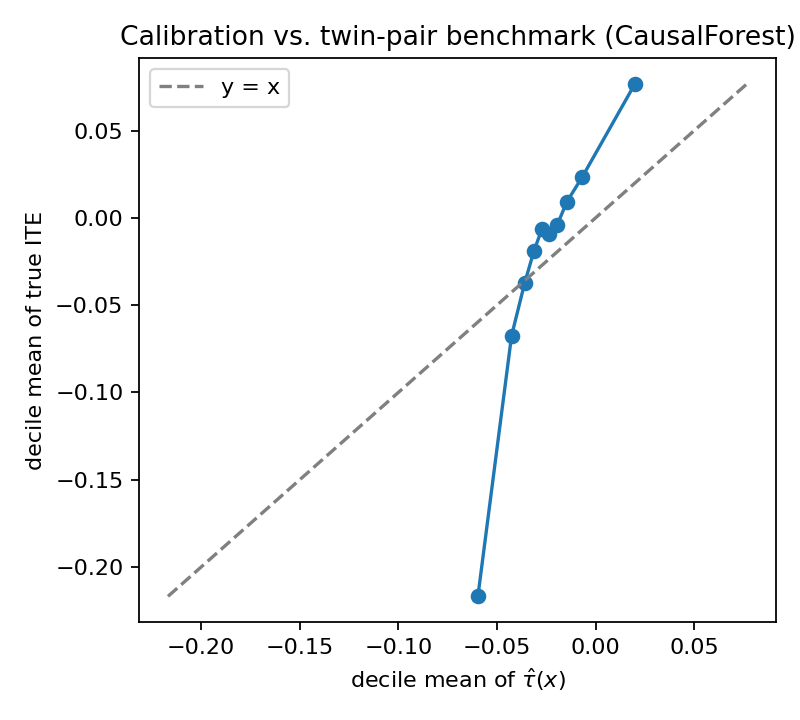
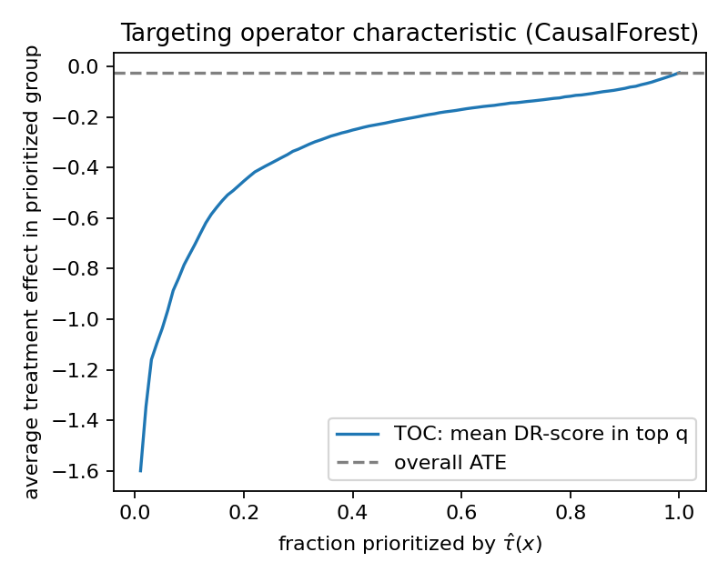

# The Causal Effect of Birthweight on Infant Mortality in the Twins Dataset

Causal Models in Data Science: Final Project Report

Hannah Yamashita

All tables and figures come from running `python scripts/run_all.py` with seed 0. The repository includes the code, raw-data instructions, generated results, and figures.

## 1. Causal Question and Motivation

Low birthweight is strongly associated with infant mortality, but the key causal question is whether birthweight itself affects mortality or whether the association mostly reflects maternal and pregnancy risks that also lead to lower birthweight. This distinction matters for intervention. If birthweight has a causal effect, improving fetal growth may reduce mortality. If the association is mostly confounding, resources may be better directed toward the underlying maternal and pregnancy conditions.

I study this question with the Twins dataset, preprocessed by Louizos et al. (2017), restricted to same-sex twin pairs where both infants weigh under 2 kg. The treatment is being the heavier twin, `T = 1`. The outcome is one-year mortality, `Y`. The covariates, `X`, are 50 maternal and pregnancy characteristics such as gestational age, prenatal visits, parity, maternal age and education, race, marital status, and medical risk indicators.

The project estimates two causal quantities. The first is the average treatment effect, or ATE: among these twin pairs, what is the average effect of being the heavier twin on one-year mortality? The second is the conditional average treatment effect, or CATE: how does that effect vary across measured maternal and pregnancy characteristics?

The report proceeds as follows. Section 2 describes the data and preprocessing. Section 3 states the identification assumptions and estimators. Section 4 presents the main ATE and CATE results. Section 5 evaluates the estimates using the twin-pair benchmark, refutation tests, model-selection diagnostics, and sensitivity analysis. Section 6 summarizes the conclusion and limitations.

The main result is that being the heavier twin reduces one-year mortality by about 2.4 to 2.5 percentage points. The AIPW estimate is -0.0248 with a 95% CI from -0.0375 to -0.0122, and it closely matches the within-pair benchmark of -0.0252. CATE results are more fragile: the causal forest ranks pairs best, but subgroup analyses based only on AIPW can be misleading.

## 2. Exploratory Data Analysis and Preprocessing

The raw data come from the AMLab-Amsterdam CEVAE repository. I filter to twin pairs where both birthweights are present and below 2000 g, both one-year mortality outcomes are present, and non-covariate ID columns are removed. Remaining missing covariates are median-imputed. The final analysis sample has 11,984 pairs and 50 covariates.

The 50 covariates fall into four groups. Pregnancy variables include gestational age (`gestat10`), prenatal visits, parity, and birth order. Maternal demographics include age, education, race, marital status, and birthplace. Maternal risk indicators include anemia, diabetes, chronic and pregnancy-induced hypertension, eclampsia, and preterm history, plus tobacco and alcohol use. Administrative controls include state, birth month, and data year.

Because the raw Twins benchmark observes mortality for both the heavier and lighter twin in each pair, the within-pair mortality difference can be used later as validation data. To create an observational-study setting, I follow Louizos et al. and select one twin per pair using a covariate-dependent assignment rule:

`p_i = sigmoid(z_i^T w + n_i),  T_i ~ Bernoulli(p_i)`

Here `z_i` is the standardized covariate vector, `w` is a random coefficient vector, and `n_i` is noise. The observed outcome is the selected twin's mortality. The other twin's outcome is held back and used only for validation. This setup is useful because it lets us test whether observational causal estimators recover a known design-based benchmark.

The observed mortality rate is 0.164 for the heavier-twin group and 0.193 for the lighter-twin group, giving a naive difference of -0.028. The true within-pair ATE is -0.025. The naive estimate is close but slightly more negative, which is exactly why adjustment is still needed: treatment assignment was simulated to depend on covariates that also predict mortality.

The propensity-score overlap plot shows strong overlap between treatment groups, so I do not trim observations. Standardized mean differences show meaningful pre-adjustment imbalance, especially in state or region, birthplace, race, birth order, and parental education. This is important because the estimators are not solving an artificial no-confounding problem; they need to adjust for real imbalance while still having enough overlap to be credible.

{width=3.5in}

**Figure 1: Propensity-Score Overlap**

{width=3.5in}

**Figure 2: Top 20 Covariate Imbalances**

## 3. Causal Identification and Estimation

Conceptually, the causal structure is that maternal and pregnancy covariates affect both which twin is selected as the heavier-twin observation and the mortality outcome. Therefore, these covariates create backdoor paths between treatment and outcome. I adjust for the observed covariates `X` and rely on conditional ignorability, positivity, consistency, and a pair-level version of SUTVA for identification.

Identification relies on four assumptions:

1. Conditional ignorability: `Y(0), Y(1) independent of T given X`. In the simulated observational study, this is justified because treatment assignment is generated from observed covariates.
2. Positivity: each covariate profile has a nonzero probability of being assigned to either treatment group. The overlap plot supports this.
3. Consistency: the observed outcome equals the potential outcome under the observed treatment.
4. SUTVA, interpreted carefully: treatment is defined within a pair as heavier versus lighter, so the estimand is a pair-level contrast rather than a literal policy of changing one infant's birthweight in isolation.

For the ATE, I use two estimators. Outcome regression estimates `E[Y | X, T]` and averages the predicted difference `mu_1(X) - mu_0(X)`. AIPW combines the outcome model with a propensity model: the AIPW score for unit `i` is `psi_i = mu_1(X_i) - mu_0(X_i) + T_i (Y_i - mu_1(X_i)) / e(X_i) - (1 - T_i)(Y_i - mu_0(X_i)) / (1 - e(X_i))`, and the estimate is the mean of those scores with SE `sd(psi) / sqrt(n)`. AIPW is less dependent on either model being correct, which matters because rare binary outcomes can make any single model unstable.

For CATE, I fit five estimators: S-learner, T-learner, DR-learner, R-learner, and causal forest. The S- and T-learners are useful baselines. The DR-learner regresses the AIPW pseudo-outcome (the same `psi_i` above) on `X` with a regularized GBM. The R-learner minimizes `sum_i (y_tilde_i - t_tilde_i * tau(X_i))^2` where `y_tilde = Y - m_hat(X)` and `t_tilde = T - e_hat(X)`, which becomes a weighted regression of `y_tilde / t_tilde` on `X` with weights `t_tilde^2`. Both should reduce sensitivity to first-stage nuisance errors. The causal forest is designed to find treatment-effect heterogeneity directly and provides pointwise confidence intervals.

All AIPW, DR, and R estimates use five-fold cross-fitted nuisance functions. The propensity model is L2-regularized logistic regression, the outcome model is gradient-boosted trees, and propensity scores are clipped to `[0.01, 0.99]`.

## 4. Results and Comparative Analysis

Table 1 shows the ATE estimates. Both methods recover a protective effect of about 2.5 percentage points. The agreement between outcome regression and AIPW is important because the two methods rely on different modeling structures. It suggests the main ATE conclusion is not driven by one estimator alone.

**Table 1: ATE Estimates**

| method | estimate | SE | 95% CI |
|---|---:|---:|---|
| Outcome regression | -0.0242 | 0.00057 | (-0.0253, -0.0230) |
| AIPW | -0.0248 | 0.00647 | (-0.0375, -0.0122) |
| Within-pair benchmark | -0.0252 | 0.00292 | -- |

The outcome-regression SE is based on a fixed-nuisance bootstrap, so I treat the AIPW influence-function SE as the main uncertainty estimate. The AIPW interval covers the within-pair benchmark.

The CATE estimators agree on the average effect but disagree on how much heterogeneity exists. That means a model can get the ATE right while still ranking individuals or subgroups poorly.

**Table 2: CATE Estimators**

| method | mean CATE | sd CATE |
|---|---:|---:|
| S-learner | -0.0179 | 0.0115 |
| T-learner | -0.0250 | 0.0622 |
| DR-learner | -0.0250 | 0.1683 |
| R-learner | -0.0245 | 0.0586 |
| Causal forest | -0.0242 | 0.0215 |
| True ITE | -0.0252 | 0.3199 |

To compare the spreads against something meaningful, I built a non-parametric lower bound on the true `sd[tau(X)]` by binning units into 50 bins ranked by causal forest prediction and taking the between-bin variance of the true ITE. That gives `sd[tau(X)] >= 0.079`. Against this benchmark, the S-learner (0.012) and causal forest (0.022) clearly under-disperse, T (0.062) and R (0.059) are closest to the bound, and DR (0.168) over-disperses badly — its spread is mostly noise. The true ITE sd of 0.32 is mechanically larger than any estimator's because each ITE lives in {-1, 0, +1}, so the right comparison is to the lower bound, not to the raw ITE sd.

The causal forest has the best rank correlation with the true within-pair effects, but its CATE distribution is still much smoother than the raw ITE distribution. That is expected because individual binary outcomes contain a lot of noise. The right question is not whether the model reproduces every pair's observed difference, but whether it ranks and summarizes heterogeneity better than chance.

## 5. Evaluation

### 5.1 ATE Refutations

I run three DoWhy-style refutation tests on the AIPW estimate.

**Table 3: ATE Refutation Tests**

| test | original ATE | refuted ATE | change |
|---|---:|---:|---:|
| Placebo treatment | -0.0248 | -0.0003 | +0.0245 |
| Random common cause | -0.0248 | -0.0252 | -0.0003 |
| 80% subset refuter | -0.0248 | -0.0235 | +0.0013 |

These checks support the ATE result. The placebo estimate collapses to about zero, which is what should happen if the treatment label is destroyed. Adding a random covariate barely changes the estimate, which suggests the procedure is not overly sensitive to irrelevant controls. Re-estimating on 80% subsamples produces nearly the same result, so the ATE is not being driven by a small set of observations.

### 5.2 CATE Ground-Truth Evaluation

The Twins benchmark lets me compare predicted CATEs against the within-pair ITE, `Y_heavy - Y_light`. This is the strongest evaluation available because most real observational datasets do not provide any ground truth for heterogeneity.

**Table 4: CATE Evaluation Results**

| method | PEHE | bias | Spearman rho | Kendall tau |
|---|---:|---:|---:|---:|
| S-learner | 0.3199 | +0.0073 | 0.020 | 0.016 |
| T-learner | 0.3183 | +0.0002 | 0.103 | 0.084 |
| DR-learner | 0.3600 | +0.0002 | 0.036 | 0.029 |
| R-learner | 0.3213 | +0.0007 | 0.046 | 0.037 |
| Causal forest | 0.3160 | +0.0010 | 0.197 | 0.160 |

The causal forest performs best, especially on rank correlation. The PEHE differences are small because the true ITE is noisy and binary, but ranking matters for heterogeneity: a useful CATE model should identify which pairs are more likely to benefit from being heavier. The causal forest does that better than the meta-learners.

### 5.3 Ground-Truth-Free CATE Diagnostics

I also evaluate CATE models using held-out R-loss and DR-score MSE. These are the kinds of diagnostics available when there is no twin-pair benchmark.

**Table 5: CATE Diagnostics**

| method | R-loss | DR-score MSE |
|---|---:|---:|
| S-learner | 0.0984 | 0.5015 |
| T-learner | 0.0989 | 0.5037 |
| DR-learner | 0.1010 | 0.5044 |
| R-learner | 0.0987 | 0.5033 |
| Causal forest | 0.0985 | 0.5014 |

These scores are very close across methods. They flag the DR-learner as weaker, but they do not separate the remaining models clearly. This is an important lesson: ground-truth-free CATE diagnostics are useful, but in this rare-outcome setting they have low resolution. I would not choose a heterogeneity model from one diagnostic alone.

### 5.4 Calibration and Subgroup Checks

The causal forest calibration plot bins pairs by predicted CATE. The bin means are almost monotone, which means the model is ranking pairs in a meaningful way. At the extremes, however, the predicted effects are much closer to zero than the true within-pair averages. This means the forest is useful for ranking but conservative in magnitude.

{width=3.5in}

**Figure 3: Calibration vs. Twin-pair Benchmark (Causal Forest)**

The subgroup results show why validation matters. For gestational age, AIPW suggests a monotone pattern where the effect is strongest in the longest-gestation group. The within-pair benchmark does not support that story.

**Table 6: GATE Comparisons**

| group | n | AIPW GATE | true GATE |
|---|---:|---:|---:|
| shortest gestation | 6,681 | -0.018 | -0.029 |
| middle gestation | 4,058 | -0.028 | -0.018 |
| longest gestation | 1,245 | -0.053 | -0.025 |

This does not invalidate the ATE. It shows that subgroup estimation is harder than average-effect estimation. The longest-gestation group is much smaller, and its AIPW standard error is much larger, so the subgroup pattern is more sensitive to noise.

Prenatal-care subgroup estimates are more stable. AIPW and the within-pair benchmark both show a roughly flat effect near -0.025 across the three prenatal-care groups. This makes the gestational-age disagreement look like a subgroup-specific instability rather than a failure of AIPW everywhere.

The best linear projection (BLP) gives the same warning. I regress the AIPW pseudo-outcome and the within-pair true ITE separately on eight pre-specified clinical effect modifiers, with HC3 robust standard errors:

**Table 7: Feature Coefficients**

| feature | AIPW coef [p] | truth coef [p] |
|---|---:|---:|
| gestat10 | -0.013 [0.025] | -0.0001 [0.964] |
| nprevistq | -0.000 [0.992] | -0.001 [0.763] |
| mager8 | +0.010 [0.114] | -0.002 [0.405] |
| meduc6 | +0.005 [0.419] | +0.001 [0.613] |
| anemia | -0.019 [0.577] | +0.005 [0.762] |
| diabetes | -0.047 [0.218] | +0.001 [0.948] |
| chyper | +0.112 [0.130] | +0.044 [0.097] |
| preterm | -0.039 [0.369] | +0.031 [0.065] |

AIPW flags `gestat10` as a significant modifier (p = 0.025), but the within-pair truth gives a coefficient that rounds to zero (p = 0.96). None of the truth p-values drop below 0.05. The practical conclusion is that I trust the ATE much more than the gestational-age heterogeneity claim — the AIPW BLP looks defensible on its own, with the right framework, valid robust SEs, and a sub-0.05 p-value, and only the design-based truth BLP reveals that the significant finding is spurious.

### 5.5 Causal Forest Outputs

The causal forest's top heterogeneity feature is `gestat10`, followed by birthplace, birth month, state of occurrence, and the month prenatal care began.

{width=3.5in}

**Figure 4: Top Features Driving Heterogeneity**

This ranking should be interpreted cautiously. Feature importance tells us what the forest used for splits; it does not prove that a variable is a true causal effect modifier, and the top feature, `gestat10`, is exactly the one the truth BLP shows has essentially zero linear association with the ITE. Most of the next-most-important features are administrative, where and when the birth was recorded, not biological risk factors, which is another reason to read this ranking as describing forest behavior rather than a corroborated causal mechanism. That is why the BLP and GATE comparisons are useful.

Pointwise confidence intervals from the causal forest also suggest a more apparent heterogeneity in the longest-gestation group, where 17% of intervals exclude zero. But this is exactly where the benchmark warns that the estimated subgroup pattern may be unstable.

### 5.6 RATE and CATE Refutations

The RATE curve asks whether units ranked as most protective by the causal forest actually have larger treatment effects. The curve lies below the overall ATE line for every fraction below 1, so the ranking is useful in direction. The RATE is 0.279.

{width=3.5in}

**Figure 5: Targeting Operator Characteristic**

The magnitude should not be over-interpreted because the DR pseudo-outcome can be very large when propensity scores are near the clipping boundary. The useful finding is the direction and shape of the curve, not the exact RATE value.

CATE-level refutations tell a similar story. When treatment is permuted, the DR-learner's mean CATE moves from -0.0250 to -0.0019 and its spread falls sharply. Adding an irrelevant random covariate leaves the mean essentially unchanged. Subsample refits have a median pointwise SD of 0.0095. These checks suggest the CATE surface is not pure noise, even though some subgroup claims remain unstable.

### 5.7 Sensitivity to an Unmeasured Confounder

Finally, I simulate a binary unmeasured confounder `U` with different strengths of association with treatment and outcome, append it to the covariates, and recompute AIPW across a 5 by 5 grid.

**Table 8: Sensitivity Model Estimate**

| k_T \ k_Y | 0.0 | 0.5 | 1.0 | 1.5 | 2.0 |
|---|---:|---:|---:|---:|---:|
| 0.0 | -0.0248 | -0.0241 | -0.0222 | -0.0225 | -0.0233 |
| 0.5 | -0.0257 | -0.0303 | -0.0334 | -0.0370 | -0.0385 |
| 1.0 | -0.0258 | -0.0355 | -0.0432 | -0.0478 | -0.0517 |
| 1.5 | -0.0257 | -0.0394 | -0.0488 | -0.0560 | -0.0611 |
| 2.0 | -0.0241 | -0.0395 | -0.0512 | -0.0618 | -0.0673 |

The estimate remains negative in every cell, so the qualitative conclusion is robust within this sensitivity model. The magnitude changes, so I do not read the exact corner estimates literally. The main point is that the protective sign does not disappear.

{width=3.5in}

**Figure 6: Sensitivity to a Single Unmeasured Confounder**

## 6. Conclusion and Future Work

The main causal conclusion is that, among same-sex twin pairs where both infants weigh under 2 kg, being the heavier twin lowers one-year mortality by about 2.5 percentage points. The ATE result is stable across outcome regression, AIPW, the within-pair benchmark, refutation tests, and the unmeasured-confounder grid.

The heterogeneity results are more mixed. The causal forest provides the best CATE ranking, but the GATE and BLP checks show that some subgroup patterns, especially by gestational age, do not survive comparison with the within-pair benchmark. This is the central methodological lesson of the project: an estimator can recover the average effect well while still giving unreliable subgroup stories.

If I were advising someone running a similar study — rare binary outcome, large observational sample, possible unobserved confounding — I would estimate the ATE with AIPW and report the influence-function SE, run at least one auxiliary estimator like outcome regression as a triangulation check, fit the CATE with a causal forest as the headline method plus at least one orthogonalized meta-learner as a cross-check, and never report subgroup analyses without either a design-based oracle like the Twins benchmark or explicit subgroup-level propensity diagnostics. The biggest single lesson here is that the AIPW ATE and AIPW subgroup effects can be trustworthy and untrustworthy on the same dataset, and nothing inside the AIPW machinery flags it — only an external benchmark does.

The study has several limitations. The treatment is a within-pair contrast, not a direct policy intervention. The confounding is simulated, so the bias depends on the assignment rule. Unobserved factors such as placental position are not measured. The binary outcome limits heterogeneity signal, and the results apply only to same-sex twin pairs where both infants weigh under 2 kg.

Future work should tune CATE hyperparameters using held-out R-loss or DR-score MSE, compare subgroup AIPW against TMLE, add subgroup-level propensity diagnostics, and study the original non-simulated assignment with a fixed-effects twin design. I would also extend the analysis to policy learning only after the subgroup instability is better understood.

## 7. Code Repository

Repository: `https://github.com/yamashann/twins-cate-project`

The full pipeline is `python scripts/run_all.py`. It runs EDA, DAG rendering, ATE and CATE estimation, refutations, validation, and sensitivity analysis.

## References

- Almond, D., Chay, K., & Lee, D. (2005). The costs of low birthweight. QJE, 120(3).
- Athey, S., Tibshirani, J., & Wager, S. (2019). Generalized random forests. Annals of Statistics, 47(2).
- Kennedy, E. H. (2023). Towards optimal doubly robust estimation of heterogeneous causal effects. Electronic Journal of Statistics.
- Künzel, S., Sekhon, J., Bickel, P., & Yu, B. (2019). Metalearners for estimating heterogeneous treatment effects using machine learning. PNAS, 116(10).
- Louizos, C., Shalit, U., Mooij, J., Sontag, D., Zemel, R., & Welling, M. (2017). Causal effect inference with deep latent-variable models. NeurIPS.
- Nie, X., & Wager, S. (2021). Quasi-oracle estimation of heterogeneous treatment effects. Biometrika, 108(2).
- Semenova, V., & Chernozhukov, V. (2021). Debiased machine learning of conditional average treatment effects and other causal functions. Econometrics Journal, 24(2).
- Sharma, A., & Kiciman, E. (2020). DoWhy: an end-to-end library for causal inference. arXiv:2011.04216.
- Wager, S., & Athey, S. (2018). Estimation and inference of heterogeneous treatment effects using random forests. JASA, 113(523).
- Yadlowsky, S., Fleming, S., Shah, N., Brunskill, E., & Wager, S. (2025). Evaluating treatment prioritization rules via rank-weighted average treatment effects. JASA.
