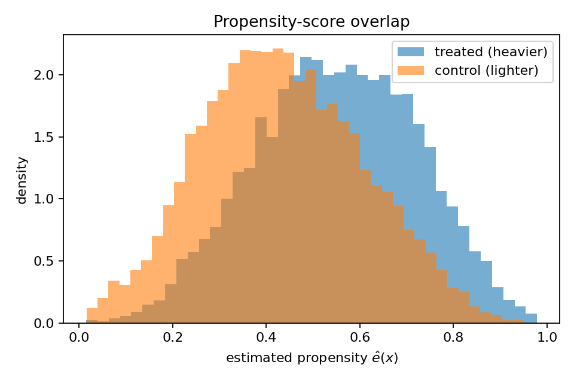
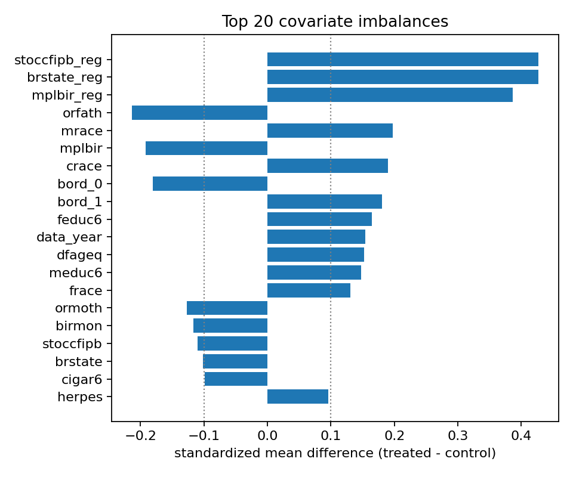
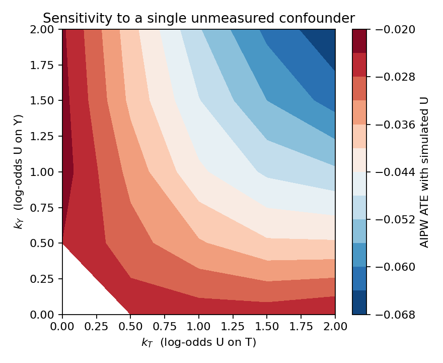

# The Causal Effect of Birthweight on Infant Mortality: ATE, CATE, and Their Validation in the Twins Dataset

**Final Project Report — Causal Models in Data Science**

*All numbers, tables, and figures in this report come from running `python scripts/run_all.py` (seed = 0) on the accompanying repository. Raw outputs live in `results/*.csv` and `figures/*.png`, and the script-to-table mapping is in the README.*

---

## 1. Causal Question and Motivation

### 1.1 Motivation

Low birthweight is one of the strongest predictors of infant mortality, but how much of that association is *causal* (rather than driven by the maternal and pregnancy conditions that produce low birthweight in the first place) directly affects which prenatal interventions are worth prioritizing. I want to estimate both an average effect and a heterogeneous effect using a sibling-controlled design.

The two causal questions are:

- (ATE) Among same-sex twin pairs in which both infants weigh under 2 kg, what is the average treatment effect of being the heavier twin on one-year mortality?
- (CATE) How does that effect vary with measured maternal and pregnancy characteristics like gestational age, parity, prenatal-care intensity, and risk indicators?

### 1.2 Context: dataset and variables

I use the **Twins dataset** as preprocessed by Louizos et al. (2017), restricted to same-sex twin pairs where both infants weigh under 2 kg. Both potential outcomes (mortality of the heavier and the lighter twin) are observed for every pair, which is the whole reason this dataset is a standard CATE benchmark. Following Louizos et al., I simulate an observational study by selecting one twin per pair with a covariate-dependent assignment rule (§2.3), and reserve the within-pair difference `Y_heavy − Y_light` as the design-based ground truth used only for validation.

- **Treatment T:** indicator for the heavier twin (1 = heavier).
- **Outcome Y:** one-year mortality (binary).
- **Covariates X:** 50 maternal and pregnancy characteristics, including gestational-age bin (`gestat10`), parity, prenatal-care visits, maternal age and education, race, marital status, and risk indicators (anemia, diabetes, hypertension, etc.).

### 1.3 Roadmap and key findings

§2 covers EDA and overlap diagnostics. §3 states identification and estimators (ATE: outcome regression and AIPW; CATE: causal forest plus S/T/DR/R-learners). §4 reports the point estimates. §5 is the evaluation block (ATE refutations, twin-pair calibration, R-loss and DR-MSE, BLP, GATEs, RATE, CATE refutations, unmeasured-confounder sensitivity). §6 concludes.

The main findings:

1. **ATE.** Both estimators recover a 2.4–2.5 pp reduction in one-year mortality, within 0.001 of the within-pair truth (−0.025).
2. **CATE.** The causal forest leads on rank correlation (Spearman ρ = 0.20 vs. 0.02–0.10 for the meta-learners) and on PEHE (0.316). The DR-learner over-disperses badly on this rare-outcome problem (sd 0.17 vs. CF's 0.02).
3. **ATE refutations** all behave the way theory predicts: placebo collapses to ≈ 0, the random covariate doesn't change anything, and 80% subsamples are stable.
4. **AIPW heterogeneity does not survive the within-pair benchmark.** AIPW GATEs and the BLP both flag a monotone `gestat10` effect (3× stronger in the longest-gestation tertile; BLP p = 0.025). The within-pair truth gives the *opposite* tertile ordering (Q1 strongest at −0.029) and a `gestat10` BLP coefficient of essentially zero (p = 0.96). The AIPW ATE is accurate; the AIPW subgroup analysis is misleading.
5. **Robustness.** The AIPW ATE stays negative across every cell of the 5×5 unmeasured-confounder sensitivity grid (−0.022 to −0.067).

---

## 2. Exploratory Data Analysis

### 2.1 Data source and preprocessing

The raw CSVs come from the AMLab-Amsterdam/CEVAE repository (Louizos et al., 2017). My preprocessing in `src/data.py`:

1. Filter to pairs where both birthweights are present and below 2000 g.
2. Filter to pairs where both one-year mortality outcomes are present.
3. Drop the ID columns (`Unnamed: 0`, `infant_id_0`, `infant_id_1`).
4. Median-impute remaining missing covariates.
5. Simulate confounded treatment assignment (§2.3).

After filtering, the analysis sample is **`n = 11,984` pairs** with **50 covariates**. One-year mortality in this low-birthweight subsample is high (**`P(Y = 1) = 0.178`**), reflecting the elevated baseline mortality risk of twin pregnancies where both infants weigh under 2 kg (`results/01_summary.csv`).

### 2.2 Variable description

The 50 retained covariates fall into four groups:

- **Pregnancy variables**: gestational age (`gestat10`), prenatal visits, parity, birth order.
- **Maternal demographics**: age, education, race, marital status, birthplace.
- **Maternal risk indicators**: anemia, diabetes, chronic and pregnancy-induced hypertension, eclampsia, preterm history, plus tobacco and alcohol use.
- **Administrative controls**: state, birth month, data year.

Full descriptions are in `data/raw/covar_desc.txt`.

### 2.3 Simulated observational study

Because both potential outcomes are observed in the raw Twins data, the unconditional ATE is trivially identified by the within-pair difference. To make this feel like a real observational study, I follow Louizos et al. (2017) and induce confounding by selecting one twin per pair with a covariate-dependent probability:

`p_i = sigmoid(z_i^T w + n_i),  T_i ~ Bernoulli(p_i)`

where `z_i` is the standardized covariate vector, `w ∼ N(0, 0.1 I)`, and `n_i ∼ N(0, 0.1)`. The observed outcome is `Y_i = Y_i(T_i)`, and the unobserved counterfactual `Y_i(1 − T_i)` is held back for validation in §5.

### 2.4 Overlap and covariate balance

Two standard pre-estimation diagnostics:

- **Propensity-score overlap** (Figure 1): cross-fit logistic propensities concentrate near 0.5 with full overlap, so no trimming was needed.
- **Standardized mean differences** (Figure 2): the largest pre-adjustment imbalances are in state/region, birthplace, race, birth-order, and parental-education variables, with top SMDs ranging from about 0.15 to 0.43. The simulated assignment is therefore meaningfully confounded, while still preserving overlap.

{ width=4in }

{ width=4in }

The observed marginal mortality rates (`results/01_summary.csv`) are 0.164 for the heavier twin and 0.193 for the lighter twin, a naïve difference of −0.028. The within-pair (true) ATE is **−0.025**. The naïve difference is slightly more negative than the truth because the simulated assignment correlates with covariates that also predict mortality, which is exactly the confounding that §3 is meant to correct.

---

## 3. Causal Identification and Estimation

### 3.1 DAG and identification assumptions

The graph (Figure 3) has:

- shared, unmeasured pair-level factors `U` (e.g. placental position),
- observed covariates `X` (the 50 maternal and pregnancy variables),
- treatment `T` and outcome `Y`,
- edges `U → {X, T, Y}`, `X → {T, Y}`, `T → Y`.

I rely on four standard identification assumptions:

1. **Conditional ignorability** `Y(0), Y(1) ⊥ T | X`. In the simulated observational study, treatment assignment is generated from observed covariates, so this assumption is true by construction after conditioning on X. In a real application, an unobserved common cause like U would violate this assumption; §5.11 stress-tests that threat.
2. **Positivity** `0 < P(T = 1 | X) < 1`. Verified empirically in §2.4.
3. **SUTVA / no cross-pair interference**. Treatment is mechanically defined within each pair (heavier vs. lighter), so the estimand should be read as a pair-level contrast rather than a manipulable individual birthweight intervention.
4. **Consistency** `Y = T·Y(1) + (1−T)·Y(0)`.

Under (1)–(4), `τ = E[E[Y | X, T=1] − E[Y | X, T=0]]` and `τ(x) = E[Y | X=x, T=1] − E[Y | X=x, T=0]`.

{ width=4in }

### 3.2 Nuisance estimation

AIPW and the orthogonalized CATE learners both need the outcome nuisance `μ_t(x) = E[Y | X=x, T=t]` and the propensity `e(x) = P(T=1 | X=x)`. I estimate both with 5-fold cross-fitting in `src/nuisance.py`, so each observation's nuisance prediction comes from a model fit on a fold that excludes it. The propensity uses an L2-regularized logistic regression on standardized features, the outcome uses gradient-boosted trees, and propensities are clipped to `[0.01, 0.99]`.

### 3.3 ATE estimators

1. **Outcome regression (g-formula plug-in).** `τ̂_OR = (1/n) Σ_i [μ̂_1(X_i) − μ̂_0(X_i)]`, with a non-parametric bootstrap SE (200 resamples). The bootstrap holds the cross-fit nuisances fixed, so it understates the true SE, and I rely on AIPW for inference.
2. **AIPW (doubly robust).** With the influence function
   `ψ_i = μ̂_1(X_i) − μ̂_0(X_i) + T_i(Y_i − μ̂_1(X_i))/ê(X_i) − (1 − T_i)(Y_i − μ̂_0(X_i))/(1 − ê(X_i))`,
   the estimator is `τ̂_AIPW = mean(ψ_i)` with SE = `sd(ψ_i)/√n`.

AIPW is consistent if *either* the outcome or the propensity model is correctly specified, while OR needs the outcome model.

### 3.4 CATE estimators

I fit five CATE estimators (`src/cate.py`). AIPW and the DR/R-learners share the cross-fit nuisances from §3.2; the causal forest does its own internal 5-fold cross-fitting via `CausalForestDML`:

- **S-learner**: one GBM on `[X, T]`; `τ̂(x) = μ̂(x, 1) − μ̂(x, 0)`.
- **T-learner**: two arm-specific GBMs, then difference.
- **DR-learner** (Kennedy 2023): regress the AIPW pseudo-outcome on `X` with a regularized GBM (depth 2, subsample = 0.5).
- **R-learner** (Nie & Wager 2021): minimize `Σ_i (ỹ_i − t̃_i τ(X_i))²` with `ỹ = Y − m̂(X)` and `t̃ = T − ê(X)`. In practice this becomes a weighted regression of `ỹ/t̃` on `X` with weights `t̃²`.
- **Causal forest** (Wager & Athey 2018, via `econml.CausalForestDML`): honest tree splits targeting `τ(x)` directly, with pointwise CIs.

S- and T-learner are baselines with known failure modes (S shrinks heterogeneity to zero; T inherits arm-specific regularization mismatch). The three orthogonalized methods are the ones I expect to do most of the heavy lifting.

---

## 4. Results and Comparative Analysis

### 4.1 ATE: point estimates

Table 1 reports each ATE estimator and the within-pair design-based ground truth (`results/03_ate.csv`).

| method | estimate | SE | 95% CI |
|---|---:|---:|---|
| Outcome regression | −0.0242 | 0.00057† | (−0.0253, −0.0230)† |
| AIPW (doubly robust) | −0.0248 | 0.00647 | (−0.0375, −0.0122) |
| **Within-pair benchmark (truth)** | **−0.0252** | 0.00292 | — |

†The OR SE comes from a fixed-nuisance bootstrap and understates true uncertainty; the AIPW influence-function SE is the trustworthy one.

Both estimators recover a 2.4–2.5 pp protective effect, both within 0.001 of the within-pair truth (−0.0252), and the AIPW CI covers the truth. The agreement between a single-model g-formula and a doubly robust estimator is the cross-method triangulation I committed to in the proposal.

### 4.2 CATE: distributions and headline summaries

Table 2 (`results/04_cate_summary.csv`) shows the marginal distribution of `τ̂(x)` under each estimator alongside the marginal distribution of the true ITE.

| method | mean(τ̂) | sd(τ̂) |
|---|---:|---:|
| S-learner | −0.0179 | 0.0115 |
| T-learner | −0.0250 | 0.0622 |
| DR-learner | −0.0250 | 0.1683 |
| R-learner | −0.0245 | 0.0586 |
| Causal Forest | −0.0242 | 0.0215 |
| **True ITE** | **−0.0252** | **0.3199** |

All five methods agree on the *average* effect and disagree on the spread. To put the spreads in context, I built a non-parametric lower bound on `sd[τ(X)]` by binning units into 50 bins ranked by CF and taking the between-bin variance of the true ITE; that bound is `sd[τ(X)] ≥ 0.079`. Against this benchmark, S (0.012) and CF (0.022) under-disperse, T (0.062) and R (0.059) are closest, and DR (0.168) over-disperses with noise-dominated pseudo-outcomes (as §5.2 confirms, its spread is largely noise). The true ITE sd of 0.32 is mechanically larger than any estimator's because each ITE lives in {−1, 0, +1}, so the right benchmark is `sd[τ(X)]`, not `sd[ITE]`.

### 4.3 Method comparison and triangulation

The two ATE estimators agree to within 0.001, and both are within sampling noise of the truth. All five CATE methods agree on the mean (−0.025 to −0.018) but disagree on the spread and on which units they think are most affected. On rank correlation (§5.2), the causal forest dominates: Spearman ρ = 0.20, roughly 2× the T-learner, 5× the DR-learner, and 10× the S-learner. That matches what I expected going in (orthogonalized and honest methods over single-model baselines), but the size of the gap between the causal forest and everything else is bigger than I expected.

---

## 5. Evaluation

### 5.1 ATE refutations (DoWhy-style)

I run three refutations on the AIPW ATE (`src/refutation.py`, `results/05_refutations.csv`):

| test | original ATE | refuted ATE | Δ | p-value |
|---|---:|---:|---:|---:|
| Placebo treatment (permute T, 50 iter) | −0.0248 | −0.0003 | +0.0245 | 0.637 |
| Random common cause (add N(0,1) covariate, 20 iter) | −0.0248 | −0.0252 | −0.0003 | — |
| Subset refuter (80% resample, 30 iter) | −0.0248 | −0.0235 | +0.0013 | — |

All three behave the way theory predicts. The placebo collapses to ≈ 0 and fails to reject H₀: ATE = 0 (p = 0.64). The random covariate leaves the estimate unchanged to four decimal places. The 80% subsamples vary by about 0.001, on the same order as the analytic SE.

### 5.2 CATE: ground-truth comparison (twin-pair benchmark)

The within-pair ITE `Y_heavy − Y_light` is the design-based ground truth, so I can score each CATE estimator against it. The metrics are:

- **PEHE** (Precision in Estimating Heterogeneous Effects) = `sqrt(mean((τ̂(x) − ITE)²))`, lower is better;
- **bias** = `mean(τ̂(x) − ITE)`;
- **Spearman ρ** and **Kendall τ** rank correlations between `τ̂(x)` and the true ITE, which measure whether the estimator ranks pairs correctly.

Table 3 (`results/06_ground_truth_scores.csv`):

| method | PEHE (lower better) | bias | Spearman ρ | Kendall τ |
|---|---:|---:|---:|---:|
| S-learner | 0.3199 | +0.0073 | 0.020 | 0.016 |
| T-learner | 0.3183 | +0.0002 | 0.103 | 0.084 |
| DR-learner | 0.3600 | +0.0002 | 0.036 | 0.029 |
| R-learner | 0.3213 | +0.0007 | 0.046 | 0.037 |
| **Causal Forest** | **0.3160** | +0.0010 | **0.197** | **0.160** |

The causal forest wins on PEHE and on both rank correlations, but the PEHE gap is small in absolute terms. Predicting the marginal mean (−0.0252) for every pair gives PEHE 0.3199, so CF only beats the constant-prediction baseline by 1.2% (and DR is 12.5% *worse* than the baseline). PEHE on binary outcomes is dominated by Bernoulli noise, so the rank-correlation gap (CF 0.20 vs. 0.02–0.10 for the rest) is the more decision-relevant number: only CF produces a `τ̂(x)` ordering substantially better than chance. Bias is small everywhere (≤ 0.007).

### 5.3 CATE: ground-truth-free diagnostics (R-loss and DR-score MSE)

Without access to the within-pair truth, would the same model ordering hold? Only weakly. Table 4 (`results/06_model_selection.csv`) evaluates each learner's CATE-stage out-of-fold predictions using 5-fold held-out R-loss and DR-score MSE:

| method | R-loss | DR-score MSE |
|---|---:|---:|
| S-learner | **0.0984** | 0.5015 |
| T-learner | 0.0989 | 0.5037 |
| DR-learner | 0.1010 | 0.5044 |
| R-learner | 0.0987 | 0.5033 |
| Causal Forest | 0.0985 | **0.5014** |

The two ground-truth-free criteria are almost tied across methods. R-loss slightly prefers the S-learner, while DR-score MSE slightly prefers the causal forest, and both criteria put DR last or near last. This is useful but not decisive: the held-out criteria identify that DR is overfitting/noisy, but they do not recover the much clearer within-pair PEHE/rank-correlation ordering from §5.2. The cautionary finding is that ground-truth-free CATE model selection is low resolution on rare outcomes, so I would report multiple criteria rather than rely on a single ruler.

### 5.4 Calibration against the twin-pair benchmark

Figure 4 (and `results/06_calibration.csv`) bins observations into deciles by predicted causal-forest CATE, and for each decile plots the mean predicted `τ̂(x)` against the mean true ITE:

| decile | mean(τ̂) | mean(true ITE) |
|---:|---:|---:|
| 1 (lowest τ̂) | −0.060 | −0.217 |
| 2 | −0.043 | −0.068 |
| 3 | −0.036 | −0.038 |
| 4 | −0.031 | −0.019 |
| 5 | −0.027 | −0.007 |
| 6 | −0.024 | −0.009 |
| 7 | −0.020 | −0.004 |
| 8 | −0.015 | +0.009 |
| 9 | −0.007 | +0.023 |
| 10 (highest τ̂) | +0.020 | +0.077 |

The deciles are nearly monotone (one tiny non-monotone step between 5 and 6), so the ranking signal is real. The slope is steeper than 1 at the extremes: decile 1 predicts −0.060 against truth −0.217, and decile 10 predicts +0.020 against truth +0.077. This shrinkage at the tails is a known property of honest random forests, and it explains the gap between CF's predicted sd (0.02) and the lower bound on `sd[τ(X)]` (0.08).

{ width=4in }

### 5.5 GATEs by gestational-age tertile

Table 5 (`results/06_gate_by_gestational_age.csv`) reports Group Average Treatment Effect (GATE) estimates by tertile of `gestat10` (the gestational-age bin variable; larger values mean longer gestation). I asked `pd.qcut` for quartiles, but it returns three groups because `gestat10` is discrete and heavily concentrated on bins 2–4. Because Twins gives me per-pair ground truth, I can compare the AIPW GATE (the estimator an observational analyst would actually compute) against the within-pair true GATE (just the mean of the per-pair ITEs in the tertile):

| group | n | AIPW GATE [95% CI] | within-pair true GATE [95% CI] |
|---|---:|---|---|
| Q1 (gestat10 ∈ {1,2,3}; shortest gestation) | 6,681 | −0.018 (−0.037, +0.002) | **−0.029 (−0.038, −0.020)** |
| Q2 (gestat10 = 4) | 4,058 | −0.028 (−0.040, −0.016) | −0.018 (−0.025, −0.012) |
| Q3 (gestat10 ∈ {5,…,10}; longest gestation) | 1,245 | −0.053 (−0.098, −0.008) | −0.025 (−0.040, −0.010) |

The two estimators tell different stories. The AIPW pattern is monotone (Q1 → Q3, −0.018 → −0.053), suggesting the effect roughly triples with longer gestation. The within-pair truth is non-monotone and opposite-ordered: Q1 is strongest at −0.029, with Q2 and Q3 smaller. The most likely culprit is Q3's small `n` (1,245) and the resulting instability in the AIPW influence function, whose SE in Q3 is about 3× the SE in Q1 and Q2. An analyst without the twin-pair benchmark would have reported a spurious 3× monotone pattern as the answer, which is exactly the failure mode the validation programme in my proposal is meant to catch.

### 5.6 GATEs by prenatal-care intensity

The proposal also asked for a GATE table by prenatal-care intensity (`nprevistq`) as a second example. Like `gestat10`, it is discretely binned and `pd.qcut` again collapses to three groups (`results/06_gate_by_prenatal_care.csv`):

| group | n | AIPW GATE [95% CI] | within-pair true GATE [95% CI] |
|---|---:|---|---|
| Q1 (fewest prenatal visits) | 8,604 | −0.023 (−0.039, −0.007) | −0.024 (−0.031, −0.017) |
| Q2 | 1,418 | −0.034 (−0.064, −0.004) | −0.028 (−0.042, −0.013) |
| Q3 (most prenatal visits) | 1,962 | −0.025 (−0.049, −0.002) | −0.027 (−0.040, −0.014) |

Unlike §5.5, AIPW and truth agree here: both give a roughly flat ~−0.025 effect across all three quartiles with overlapping CIs. There is no detectable prenatal-care heterogeneity. The agreement in well-populated subgroups (n = 1,418–8,604) is reassuring because it suggests the §5.5 divergence is small-sample- and propensity-driven, not a generic AIPW failure mode.

### 5.7 Best linear projection (Semenova–Chernozhukov)

Table 6 (`results/06_best_linear_projection.csv`) regresses two targets on the same eight pre-specified clinical effect modifiers with HC3 standard errors. The first target is the AIPW pseudo-outcome (the BLP an observational analyst would actually compute, as specified in the proposal); the second is the within-pair true ITE (the design-based oracle, available only because Twins gives me both potential outcomes). I include the truth BLP as a validation check on the AIPW BLP.

| feature | AIPW coef [p] | truth coef [p] |
|---|---:|---:|
| constant | −0.036 [0.310] | −0.022 [0.131] |
| **gestat10** | **−0.013 [0.025]** | **−0.0001 [0.964]** |
| nprevistq | −0.000 [0.992] | −0.001 [0.763] |
| mager8 | +0.010 [0.114] | −0.002 [0.405] |
| meduc6 | +0.005 [0.419] | +0.001 [0.613] |
| anemia | −0.019 [0.577] | +0.005 [0.762] |
| diabetes | −0.047 [0.218] | +0.001 [0.948] |
| chyper | +0.112 [0.130] | +0.044 [0.097] |
| preterm | −0.039 [0.369] | +0.031 [0.065] |

The two BLPs disagree in two systematic ways:

1. The AIPW's only "significant" modifier (`gestat10`, p = 0.025) is essentially zero in the truth (p = 0.96), which is the same spurious-finding pattern as the GATE failure in §5.5.
2. The truth's closest-to-significant modifiers (`chyper` and `preterm`, both positive at p ≈ 0.07–0.10) are nowhere in the AIPW BLP.

Neither set is strong enough to actually recommend subgroup targeting (the truth p-values are all above 0.05). The point of the table is the disagreement itself, which is the strongest single argument in the report for why a design-based benchmark matters.

### 5.8 Causal-forest feature importance and pointwise CIs

The proposal asked for two extra causal-forest outputs: a variable-importance ranking for heterogeneity, and pointwise CIs on `τ̂(x)`.

**Feature importance** (Figure 5; full table in `results/06_causal_forest_feature_importance.csv`; top 5 shown):

| feature | importance |
|---|---:|
| `gestat10` | 0.21 |
| `mplbir` (mother's birthplace) | 0.10 |
| `birmon` (birth month) | 0.09 |
| `stoccfipb` (state of occurrence) | 0.06 |
| `mpre5` (month prenatal care began) | 0.05 |

`gestat10` dominates the importance ranking, but the truth BLP in §5.7 says it has essentially zero linear association with the ITE. So this importance reflects what the forest's splits keyed on, not a corroborated causal mechanism. The rest of the top features are mostly administrative (birthplace, birth month, state).

{ width=4in }

**Pointwise CIs on τ̂(x) by gestational-age tertile** (`results/06_causal_forest_pointwise_cis.csv`):

| group | n | mean(τ̂) | mean CI width | CI excludes 0 |
|---|---:|---:|---:|---:|
| Q1 (shortest gestation) | 6,681 | −0.022 | 0.144 | 6.5% |
| Q2 | 4,058 | −0.026 | 0.087 | 12.7% |
| Q3 (longest gestation) | 1,245 | −0.031 | 0.096 | 17.0% |

17% of Q3 pairs have CIs that exclude zero, the highest fraction of the three tertiles. That is consistent with the CF's own heterogeneity story but at odds with the within-pair truth in §5.5. The CIs are calibrated under the CF's own assumptions, not against the benchmark.

### 5.9 RATE / TOC curve

Figure 6 (and `results/06_rate_curve.csv`) is the Targeting Operator Characteristic curve for the causal forest. I sort pairs by predicted `τ̂(x)`, ascending (most-protective-first, since lower mortality is better), and for each fraction `q` plot the mean DR-score — the AIPW per-unit effect estimate `ψ_i` — in the top-`q` slice. The curve sits below the overall-ATE line for every `q < 1`, which means the model's top-ranked units have larger-magnitude (more-negative) treatment effects than the population average; the two curves meet at `q = 1` when everyone is included. Integrating the gap between the curve and the overall ATE gives **RATE = 0.279** (= ∫(overall_ATE − TOC(q)) dq; positive means the ranking beats random targeting).

One caveat on the magnitude. The DR pseudo-outcome has a `1/ê(x)` term, so units near the propensity clip can have |ψ| up to ~100×|Y|. The top-q group at small q is enriched for these high-leverage observations, which is why TOC reaches ≈ −1.6 at q = 0.01 even though the true ITE lives in [−1, +1]. The qualitative evidence of useful prioritization is the sign (positive) and the monotone shape, not the magnitude — the RATE number is on the pseudo-outcome scale, not the ITE scale, and shouldn't be compared to Table 5. Trimming to q ∈ [0.2, 1.0] gives trimmed RATE = 0.134, still inflated by the same mechanism.

{ width=4in }

### 5.10 CATE-adapted refutations

Three CATE-level analogues of the ATE refutations, run on the DR-learner (`src/cate_validation.py`, `results/06_cate_*.csv`):

- **Placebo (permuted T)**: mean `τ̂` goes from −0.0250 to −0.0019, sd from 0.168 to 0.036 (a 79% drop). The CATE surface collapses, as expected.
- **Random common cause (irrelevant N(0,1))**: mean unchanged at −0.025; pointwise RMSE vs. original = 0.036. The irrelevant noise is correctly ignored.
- **Subsample stability (3 × 80% resamples)**: median pointwise SD = 0.0095, with every pair predicted in all three refits; this is modest relative to the predicted CATE spread.

### 5.11 Sensitivity to a single unmeasured confounder

The proposal asked: how strong would a single unmeasured binary confounder have to be to overturn the qualitative conclusion (negative ATE)? I implement a simple local sensitivity analysis in the spirit of DoWhy's `add_unobserved_common_cause`: simulate `U ∈ {0, 1}` with `logit P(U = 1 | T, Y) = k_T T + k_Y Y` (equivalently, `P(U = 1 | T, Y) = sigmoid(k_T T + k_Y Y)`), append `U` to the covariate set, and recompute AIPW for each `(k_T, k_Y)` on a 5 × 5 grid (`src/sensitivity.py`, `results/07_sensitivity.csv`, Figure 7).

| k_T \ k_Y | 0.0 | 0.5 | 1.0 | 1.5 | 2.0 |
|---|---:|---:|---:|---:|---:|
| **0.0** | **−0.0248** | −0.0241 | −0.0222 | −0.0225 | −0.0233 |
| 0.5 | −0.0257 | −0.0303 | −0.0334 | −0.0370 | −0.0385 |
| 1.0 | −0.0258 | −0.0355 | −0.0432 | −0.0478 | −0.0517 |
| 1.5 | −0.0257 | −0.0394 | −0.0488 | −0.0560 | −0.0611 |
| 2.0 | −0.0241 | −0.0395 | −0.0512 | −0.0618 | −0.0673 |

The AIPW ATE stays negative across every cell of this grid, so within this sensitivity model I do not find a sign flip. The ATE actually gets *more* negative as `k_T` and `k_Y` increase, rather than collapsing to zero, because my simulated U is drawn from `P(U | T, Y)` and not from `P(U | X)`. Conditioning on U therefore adds information the original AIPW could not exploit. The conservative reading is the sign stability within the grid, not the magnitudes at the extreme corners.

{ width=4in }

---

## 6. Conclusion and Future Work

### 6.1 Summary of findings

1. **ATE.** Being the heavier twin reduces one-year mortality by 2.4–2.5 pp (AIPW 95% CI (−0.0375, −0.0122)), and both ATE estimators contain the within-pair truth (−0.0252).
2. **CATE.** The causal forest leads on rank correlation (Spearman ρ = 0.20) and PEHE (0.316). S and CF under-disperse, DR over-disperses, all failure modes I expected from the proposal and that play out cleanly here.
3. **AIPW subgroup analysis diverges from the within-pair truth.** AIPW GATEs are monotone with Q3 strongest, while the truth is non-monotone with Q1 strongest. The AIPW BLP flags `gestat10` as significant (p = 0.025), while the truth BLP says it's essentially zero (p = 0.96). The AIPW *ATE* is accurate, but AIPW *heterogeneity* is misleading on this dataset.
4. **Ground-truth-free CATE model selection is noisy.** Held-out R-loss and DR-MSE are nearly tied across S, R, and CF, and only clearly flag DR as worse. They do not recover the full PEHE leaderboard, so I would report multiple criteria rather than rely on a single one.
5. **Robustness.** ATE refutations all pass, and the sensitivity grid is sign-preserving across all 25 (k_T, k_Y) combinations.

For studies of this kind — rare binary outcome, large observational sample, possible unmeasured confounding — the pipeline I'd recommend as a defensible default is: estimate the ATE with AIPW and report the influence-function SE; report at least one auxiliary estimator (outcome regression worked here) for triangulation; estimate the CATE with a causal forest as the headline method plus at least one orthogonalized meta-learner (DR or R) as a cross-check; and never report subgroup analyses without either (i) a design-based oracle like the within-pair Twins benchmark, or (ii) explicit subgroup-level propensity diagnostics and a TMLE comparison. The biggest single lesson from this project is that the AIPW *ATE* and AIPW *subgroup effects* can be trustworthy and untrustworthy respectively *on the same dataset* — nothing inside the AIPW machinery flags the failure; only the external benchmark does.

### 6.2 Limitations

1. **Treatment is pair-defined.** "Heavier" versus "lighter" is a within-pair contrast, not a free-standing individual intervention, so the estimand is best interpreted as a pair-level comparison rather than a policy effect of increasing birthweight for one infant in isolation.
2. **Simulated confounding.** The confounding is simulated on top of the data, so the bias my methods are correcting is partly a function of the simulation knobs.
3. **Unobserved pair-level factors** (placental position, cord placement) are not in X. The sensitivity grid quantifies but cannot remove the resulting bias.
4. **Rare outcome.** P(Y=1) = 0.18 limits the effective sample for CATE, which drives both the DR over-dispersion and the R-loss/DR-MSE disagreement.
5. **AIPW subgroup analysis diverges from the truth on this dataset** (§5.5 and §5.7). I would not have caught this on a real observational dataset, which is precisely the point.
6. **Generalizability.** Results apply to same-sex twin pairs where both infants weigh under 2 kg.

### 6.3 Future work

1. **CV-tuned CATE hyperparameters.** Use the held-out R-loss/DR-MSE machinery for actual hyperparameter tuning. Right now the learners use fixed, conservative hyperparameters and the held-out scores are used for evaluation.
2. **Investigate the §5.5 AIPW-vs-truth divergence.** Trim and stabilize propensities in subgroup-level AIPW, compare against TMLE, and report subgroup propensity diagnostics alongside any GATE table.
3. **Policy learning.** Fit a policy tree on the CATE outputs and report a valid policy value.
4. **Replicate on the real (non-simulated) assignment** with a within-pair fixed-effects design, dropping the simulation knobs entirely.

---

## 7. Code repository

All code, scripts, figures, and tables in this report are produced by the repository accompanying this submission.

- **Repository:** `https://github.com/yamashann/twins-cate-project`.
- **Reproduction.** See `README.md`. The full pipeline is one command, `python scripts/run_all.py`, which runs EDA, DAG rendering, ATE and CATE estimation, refutations, validation, and the sensitivity sweep, and writes all outputs to `results/` and `figures/`.

---

## References

- Almond, D., Chay, K., & Lee, D. (2005). The costs of low birthweight. *QJE*, 120(3).
- Athey, S., Tibshirani, J., & Wager, S. (2019). Generalized random forests. *Annals of Statistics*, 47(2).
- Kennedy, E. H. (2023). Towards optimal doubly robust estimation of heterogeneous causal effects. *Electronic Journal of Statistics*.
- Künzel, S., Sekhon, J., Bickel, P., & Yu, B. (2019). Metalearners for estimating heterogeneous treatment effects using machine learning. *PNAS*, 116(10).
- Louizos, C., Shalit, U., Mooij, J., Sontag, D., Zemel, R., & Welling, M. (2017). Causal effect inference with deep latent-variable models. *NeurIPS*.
- Nie, X., & Wager, S. (2021). Quasi-oracle estimation of heterogeneous treatment effects. *Biometrika*, 108(2).
- Semenova, V., & Chernozhukov, V. (2021). Debiased machine learning of conditional average treatment effects and other causal functions. *Econometrics Journal*, 24(2).
- Sharma, A., & Kiciman, E. (2020). DoWhy: an end-to-end library for causal inference. *arXiv:2011.04216*.
- Wager, S., & Athey, S. (2018). Estimation and inference of heterogeneous treatment effects using random forests. *JASA*, 113(523).
- Yadlowsky, S., Fleming, S., Shah, N., Brunskill, E., & Wager, S. (2025). Evaluating treatment prioritization rules via rank-weighted average treatment effects. *JASA*.
